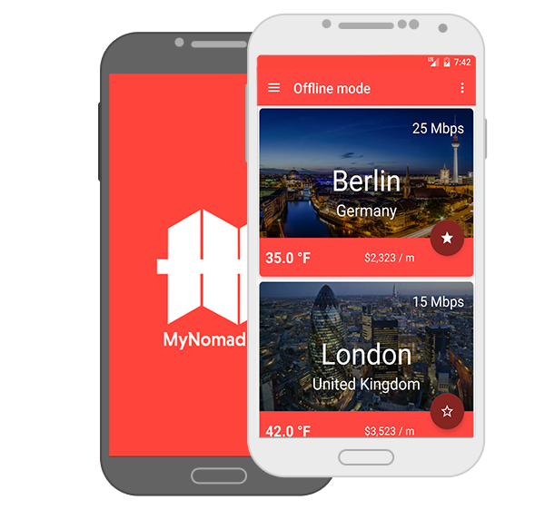
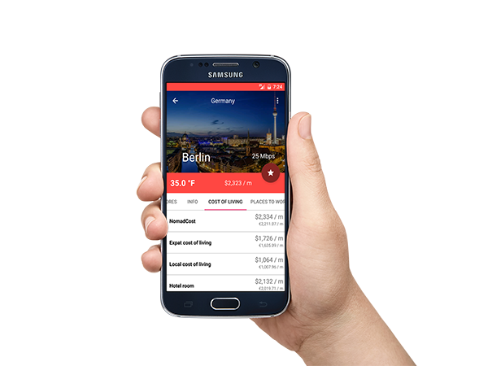

# My Nomad Life v1.0.0

(images/mynomadlife.png)

My Nomad Life is an application that provides the guide for digital nomads. If you are a traveler, then this application is right for you because the app offers you overview for your destination. Further, you can explore scores for cities, offline mode, or build a list of favorite cities.

* [Screenshots](Screenshots/)
* [Backend application - Ruby On Rails application](https://github.com/marekhakala/mynomadlife-api)



## Features

 * The application gets list of cities from website over web API
 * You can search city with parameters
 * You can mark city as favorite
 * You can mark city for offline mode
 * You can display score of city
 * You can explore places to work for selected city

## Libraries
 * [Support Design libraries](https://developer.android.com/topic/libraries/support-library/features.html) - Material design library
 * [Dagger 2](http://google.github.io/dagger/) - Dependency Injection library
 * [Butter Knife](http://jakewharton.github.io/butterknife/) - UI binding library
 * [Retrofit 2](http://square.github.io/retrofit/) - Web API library
 * [Picasso](http://square.github.io/picasso/) - Image handling library
 * [RxJava](https://github.com/ReactiveX/RxJava) - Asynchronous and event-based programs library
 * [SQLBrite](https://github.com/square/sqlbrite) - A lightweight wrapper around SQLiteOpenHelper and ContentResolver
 * [Timber](https://github.com/JakeWharton/timber) - Advanced logging library
 * [LeakCanary](https://github.com/square/leakcanary) - A memory leak detection library

## Udacity Nanodegree Capstone Project


 # License - Apache License, Version 2.0

 ```
 # (C) Copyright 2017 by Marek Hakala <hakala.marek@gmail.com>
 # Licensed under the Apache License, Version 2.0 (the "License");
 # you may not use this file except in compliance with the License.
 # You may obtain a copy of the License at
 #
 # http://www.apache.org/licenses/LICENSE-2.0
 #
 # Unless required by applicable law or agreed to in writing, software
 # distributed under the License is distributed on an "AS IS" BASIS,
 # WITHOUT WARRANTIES OR CONDITIONS OF ANY KIND, either express or implied.
 # See the License for the specific language governing permissions and
 #    limitations under the License.
 ```
